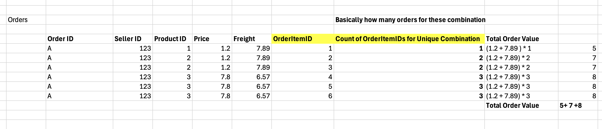
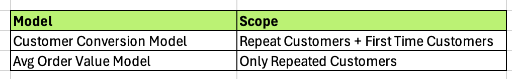
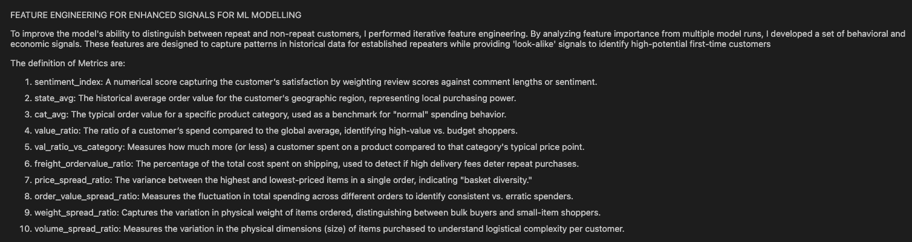
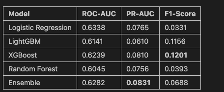
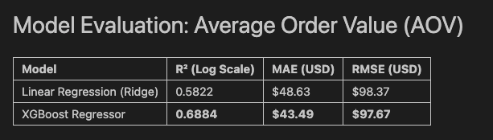

### End-to-End Pipeline Flow
Source Data → EDA → Mart Layer → Modeling → Feature Engineering → Evaluation

---

## 1. Data Understanding & Methodology
### 1.1 Source Data
- This project uses a multi-table e-commerce dataset containing customer, order, product, payment, review, seller, and geolocation information to analyze purchasing behavior and predict customer loyalty.

### 1.2 Objective 
- The data is used to predict whether a first-time customer will become a repeat buyer and to estimate the expected order value based on their initial purchase behavior.

### 1.3 Exploratory Data Analysis (EDA)

**Nulls & Basic Transformations**  
- Null value checks and basic data cleaning were performed across all tables to ensure schema consistency and reliable downstream joins. Missing values were analyzed.

**Repeat Customer Analysis**  
- Customer behavior was analyzed using `customer_unique_id` as the true customer identifier, enabling clear separation between first-time and repeat buyers. Purchase timelines were examined to understand ordering frequency and customer retention patterns.

**Class Imbalance Insight**  
- EDA revealed a severe class imbalance, with only ~3% of customers making repeat purchases. This insight informed model evaluation strategy and metric selection, with emphasis on PR-AUC over accuracy.

**Data Modeling Implications**  
- Findings from EDA directly guided mart design and feature engineering, ensuring consistent grain alignment across datasets and preventing data leakage during model training.

---

## 3. Data Modeling (Mart & Schema Design)

### 3.1 Grain Alignment Strategy

**1. Identifying Grain Mismatches**  
- During data exploration, we identified that different source tables existed at different levels of granularity (e.g., order-level, product-level, seller-level, and review-level). Directly joining these tables would have resulted in record duplication and inflated metrics.

**2. Aggregation & Roll-Up Validation**  
- To address this, each table was pre-aggregated to a common grain (primarily `order_id`) using appropriate roll-up logic. Aggregations were carefully validated by reconciling totals (such as item counts and order values) against source data to ensure no loss or distortion of information.

**3. Duplicate Detection & Prevention**  
- Extensive checks were performed to identify duplicate keys and unintended row multiplication after joins. This ensured that each order and customer was represented exactly once in the master dataset, preserving data integrity and preventing leakage into the modeling pipeline.

### 3.2 Mart-Level Transformations

Two key mart-level transformations were implemented to ensure data consistency and enrich modeling features.

**1. Order Items Roll-Up**  
- The `order_items` table operates at a composite grain of `order_id`, `seller_id`, and `product_id`. To enable order-level analysis, item-level records were aggregated at this composite grain to infer quantities and compute monetary metrics. These metrics were then rolled up to the `order_id` level, ensuring join-safe integration with other order-level marts.

**2. Customer–Seller–Geography Enrichment**  
Customer and seller datasets contained duplicate zip code prefixes, and the geolocation table mapped a single zip code to multiple latitude–longitude pairs. To address this, a bridge table was created at the zip-level by selecting the mos

### 3.3 Master Table Construction

- Once all upstream marts were validated and aligned to a **unique `order_id` grain**, they were integrated to form the final master table. Each mart was joined using **left joins** with the core orders table to ensure full order coverage while preserving data integrity. This approach produced a single, unified order-level dataset containing customer, product, payment, review, and geographic features, suitable for downstream analysis and modeling.

## 4. Label Construction Methodology

This section outlines the logic used to derive target variables from transactional data. By transforming raw purchase history into behavioral labels, the modeling approach focuses on predicting long-term customer value rather than isolated transactions.

### 4.1 Customer Conversion (Loyalty) Label

The conversion label identifies customers who transition from one-time buyers to repeat purchasers.

**Scope**  
This logic is applied across the entire dataset, covering both first-time and repeat customers.

**Label Definition**
- **Converted (1):** Customers with two or more unique `order_id` values across their lifetime.
- **Non-Converted (0):** Customers with only a single recorded order.

**Methodology**
Customer-level order history was analyzed using the full dataset to determine conversion status. The resulting label was then mapped back to the `order_id` grain, allowing the model to learn which characteristics of an initial purchase are indicative of future return behavior.

---

### 4.2 Order Value Label (Average Order Value – AOV)

In addition to conversion, a continuous target was defined to capture customer spending behavior.

**Scope**  
This label is applied exclusively to repeat customers.

**Label Definition**  
For each repeat customer, the **Average Order Value (AOV)** was calculated as:

\[
\text{AOV}_c = \frac{1}{N_c} \sum_{i=1}^{N_c} \text{TotalOrderValue}_{c,i}
\]

The computed AOV was assigned as the target value for all orders associated with that customer.

**Predictive Intent**  
By predicting a customer’s average spend rather than a single future transaction, the model reduces sensitivity to outlier purchases and focuses on stable spending behavior. This enables more reliable estimation of long-term revenue and customer lifetime value (LTV).

---

## 5. Modeling & Evaluation

  

### 5.1 Machine Learning Model 1: Customer Conversion (Loyalty Prediction)

The objective of this model is to predict the probability that a customer transitions from a one-time buyer to a repeat customer based on their initial transactional and behavioral signals.(Both for Repeated and First Time Customers)
This model focuses on learning **behavioral patterns** that indicate long-term customer retention rather than short-term transactional noise.
### Model Selection & Iteration

A **Champion–Challenger** approach was adopted to evaluate multiple algorithms and identify the most effective modeling strategy:

- **Baseline Model:** Logistic Regression, used to establish a performance floor and provide interpretability.
- **Tree-Based Models:** Random Forest, XGBoost, and LightGBM to capture non-linear interactions in customer behavior.
- **Final Approach:** An ensemble model combining the strongest gradient-boosted tree models to improve predictive stability and robustness.

### 5.2 Key Challenges & Mitigation Strategies

**Class Imbalance**
- The dataset exhibited severe imbalance, with repeat customers representing a small minority.
- This made it difficult for models to identify weak but meaningful loyalty signals.

**Solution**
- Extensive feature engineering was performed to amplify behavioral signals, including purchase diversity, temporal patterns, and spending characteristics.

**Model Diagnostics & Validation**
- Conducted data leakage audits to ensure no future information was present in first-order features.
- Applied scaling and skewness correction to monetary features to improve model convergence.
- Used GridSearchCV to find optimal hyperparameters for training Models.
- Analyzed feature importance using model-based metrics and SHAP values to confirm that predictions were driven by meaningful signals.

**Noise Reduction**
- Examined feature correlations to identify and remove highly collinear variables.
- This reduced redundancy, simplified the feature space, and improved generalization to unseen data.

### 5.3 Key Modeling Insights

**Signal Amplification**  
- Raw transactional features alone were insufficient to distinguish repeat customers in a highly imbalanced dataset. Extensive feature engineering was required to amplify weak but meaningful loyalty signals.

**High-Impact Features**  
- Derived metrics such as a **Sentiment Index** (capturing customer satisfaction) and **Engagement Velocity** contributed the most significant predictive lift. Detailed list for improving signals for repeat customers is below

  

**Ratio-Based Features**  
- Tree-based models performed more effectively when using **ratio features** (e.g., value-to-volume) rather than individual raw metrics, as ratios enabled more informative decision splits.

**Model Selection Outcome**  
- XGBoost emerged as the strongest individual model due to its robustness to sparse data and missing values.

**Noise Reduction Strategy**  
- Highly correlated and redundant features were identified using a correlation matrix and removed to reduce noise and improve generalization.

**Performance Gain**  
- The combined impact of ratio-based feature engineering and noise reduction resulted in a **4× improvement in PR-AUC**, increasing performance from a ~2% baseline to **~8.3%**.

**Feature Importance**
- Customers with higher item counts and balanced pricing are more likely to convert, while verbose reviews and specific payment patterns signal lower repeat propensity.

### Evaluation Metrics

Given the strong class imbalance in the dataset, model performance was evaluated using metrics that focus on ranking quality and minority-class detection rather than overall accuracy.

**Metrics Used**
- **ROC-AUC:** Measures the model’s ability to rank positive examples above negative ones across all thresholds.
- **PR-AUC:** Captures precision–recall trade-offs and is the primary metric for evaluating performance on the minority (repeat customer) class.
- **F1-Score:** Balances precision and recall at a fixed threshold, providing insight into practical classification performance.
  
### 5.4 Model Evaluation Summary

Model evaluation results highlight the trade-offs between ranking quality and classification performance under severe class imbalance.

- **Ensemble models** achieved the highest **PR-AUC (~8.3%)**, indicating the strongest ability to identify repeat customers above a ~3% baseline.
- **XGBoost** delivered the best **F1-Score**, suggesting better balance between precision and recall at the chosen operating point.
- **Logistic Regression** provided a strong ROC-AUC baseline but underperformed on recall-sensitive metrics.
- **Tree-based models** consistently outperformed linear approaches on PR-AUC, reflecting their ability to capture non-linear customer behavior patterns.

Overall, **PR-AUC was prioritized over accuracy and ROC-AUC**, as it better reflects real-world performance when predicting rare but high-value repeat customers.

### 5.5 Machine Learning Model 2: Average Order Value (AOV Prediction)

This model focuses on predicting the **Average Order Value (AOV)** a repeat customer is expected to generate, enabling stable forecasting of long-term revenue rather than volatile single-transaction estimates.

### Model Objective & Scope

- **Objective:** Predict customer-level AOV as a proxy for long-term spending behavior.
- **Target Population:** Restricted to **repeat customers only**, as their historical purchasing patterns provide a more reliable signal than one-time transactions.

### Model Selection & Approach

- Evaluated **Linear Regression** and multiple **tree-based models**.
- **XGBoost** emerged as the top-performing model due to its ability to capture non-linear relationships between customer behavior and spend.

### Key Design Decisions

**Averaging for Stability**  
- Instead of predicting the next transaction value, the model predicts the **average of all historical orders (total)**, reducing sensitivity to one-off or seasonal spikes.

**Ratio-Based Feature Engineering**  
- Engineered ratio features (e.g., value-to-volume, item-frequency-to-total-spend), which enabled cleaner decision splits compared to raw monetary or quantity features.

**Behavioral Signal Retention**  
- Average Order Value is primarily driven by payment behavior (credit card usage and installment patterns) and product category mix, while excessive installment counts negatively impact long-term spending.

**Noise Reduction & Regularization**  
- Applied correlation analysis to remove redundant financial features, reducing overfitting and improving Mean Absolute Error (MAE).

### 5.6 Key Observations & Insights

- **Stability Over Volatility:** Predicting AOV yields more reliable results than forecasting individual order values due to natural noise reduction from averaging.
- **Unified Behavioral Drivers:** Features effective for loyalty prediction (e.g., sentiment and ratios) were also strong predictors of AOV.
- **Tree-Based Efficiency:** XGBoost outperformed linear models by handling the long-tail distribution of customer spending more effectively.

### 5.6 Train–Test Split Strategy

To accurately simulate real-world deployment, the dataset was split using a **temporal (time-based) strategy** rather than random sampling.

- The model was trained on **historical data**, representing past customer behavior.
- Evaluation was performed on **future time periods**, ensuring that predictions were tested on unseen, chronologically newer data.
- This approach prevents information leakage across time and provides a more realistic assessment of how the model would perform in production.

By training on past data and validating on newer transactions, the evaluation closely mirrors real-world usage where models are applied to predict future customer behavior.

---

## 6. Key Challenges & Design Decisions

- **Grain mismatches across datasets:** Source tables existed at different levels of granularity, requiring pre-aggregation to a common grain to prevent duplication and distorted metrics.
- **Data leakage prevention:** All features were derived strictly from information available at the time of the first order, with future behavior used only for label construction.
- **Class imbalance handling:** Severe class imbalance (~3% repeat customers) was addressed through feature engineering and appropriate evaluation metrics rather than naive resampling.
- **Metric selection rationale:** PR-AUC was prioritized over accuracy to accurately evaluate model performance on the minority class.

---

## 7. How to Run the Project

1. Clone the repository to your local machine.
2. Ensure all required libraries are installed (see `requirements.txt`).
3. Run the EDA notebooks first, followed by the Mart notebooks.  
   - Run the **Orders Mart notebook last**, as it creates the final master table.
4. Execute the feature and label notebooks:
   - `MasterOrders`
   - `MasterOrderValue`
5. Train and evaluate the models:
   - Customer Conversion model
   - Order Value (AOV) model

## 8. Project Structure

📦 project-root  
├── 📂 Source Data  
│   └── Raw input datasets used for analysis and modeling  
│
├── 📂 EDA  
│   └── Exploratory notebooks for data understanding, quality checks, and behavioral analysis  
│
├── 📂 Data Modelling  
│   └── Mart-level transformations and grain alignment logic  
│
├── 📂 Processed Data  
│   └── Cleaned, aggregated, and mart-level datasets ready for feature engineering  
│
├── 📂 Features and Label  
│   ├── Feature engineering notebooks  
│   └── Label construction notebooks (Customer Conversion & Order Value)  
│
├── 📂 ML Model  
│   ├── Customer Conversion model notebooks  
│   └── Average Order Value (AOV) model notebooks  
│
├── 📂 Images  
│   └── Diagrams and visual assets used in the README and reports  
│
└── 📜 README.md  
    └── Project documentation and execution guide

---

## 9. Known Constraints

Every data project operates within practical boundaries. The following constraints were identified in the current workflow:

- **Granularity Alignment:** Source data existed at multiple grains (product, seller, and order). Aligning these into a single order-level master table was necessary for modeling, but resulted in the loss of some fine-grained, item-level behavioral variance.
- **Class Imbalance:** Customer conversion data was highly imbalanced, with significantly fewer repeat customers than one-time buyers. While mitigation strategies were applied, this remains an inherent constraint on model sensitivity.
- **Temporal Limitations:** The modeling approach relies on static snapshots of customer behavior. The absence of real-time or streaming data limits responsiveness to immediate, in-session customer signals.
- **Feature Scope:** Feature engineering was limited to internally available schema and datasets, excluding external or third-party signals such as macroeconomic or behavioral enrichment data.

---

## 10. Planned Improvements

To evolve this project toward a more production-grade system, the following enhancements are proposed:

- **Advanced Modeling Architectures:** Extend beyond traditional linear and tree-based models to explore deep learning approaches such as Multilayer Perceptrons (MLPs) for capturing complex, non-linear customer behavior patterns.
- **Automated Data Validation:** Introduce automated data quality checks and unit tests (e.g., using Great Expectations) to ensure consistency and integrity as new data is ingested.
- **Dynamic Feature Engineering:** Transition from static mart-based features to a centralized Feature Store to enable better versioning and point-in-time feature retrieval.
- **Enhanced Model Explainability:** Incorporate advanced explainability techniques such as SHAP or LIME to provide customer-level insights into model predictions and improve trust and interpretability.

## 11. Use of AI Tools

AI tools were used as productivity accelerators throughout the project, while all core logic, modeling decisions, and validations were performed manually.

- **Report & Documentation Generation:**  
  Large Language Models (GPT) were used to assist in drafting, refining, and structuring technical documentation and README content.

- **Diagram & Image Creation:**  
  Initial workflow diagrams were created manually (e.g., in Excel) and refined using AI-assisted image generation tools to produce clear, presentation-ready visuals.

- **Debugging & Code Review:**  
  AI tools were leveraged to accelerate debugging, sanity-check transformations, and validate implementation logic during development.

